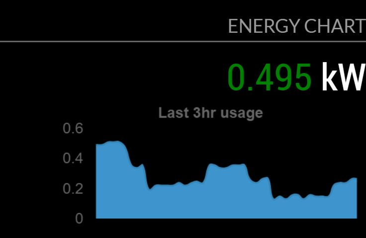

# MMM-Wattvision
MagicMirror module to get energy consumption via a Wattvision API

## API
Uses the open/free api that Wattvision publishes: https://www.wattvision.com/api/v0.2/elec?sensor_id=:sensor_id&api_id=:api_id&api_key=:api_key&type=:type&start_time=:start_time&end_time=:end_time

Information here : https://wattvision.readme.io/docs/download-data-from-wattvision

Get your API id and key from : https://www.wattvision.com/usr/api

Get your sensor id from the settings page after you setup your device with wattvision

## Preview


## Install the module
 Go to your MagicMirror modules directory by entering `cd MagicMirror/modules`

 run `git clone https://github.com/vincep5/MMM-Wattvision`

 run `cd MMM-Wattvision` to get into the newly created folder

 run `npm install` to install the chart.js dependencies


## Config
Add `MMM-Wattvision` module to the `modules` array in the `config/config.js` file:
````javascript
modules: [
  {
    module: "MMM-Wattvision",
    position: "top_right",
    header: "EnergyChart",
    config: {
      updateInterval: 10 * 60 * 1000, // every 10 minutes
      sensor_id: '', // value from wattvision
      api_id: '', // value from wattvision
      api_key: '' // value from wattvision
      }
  },
]
